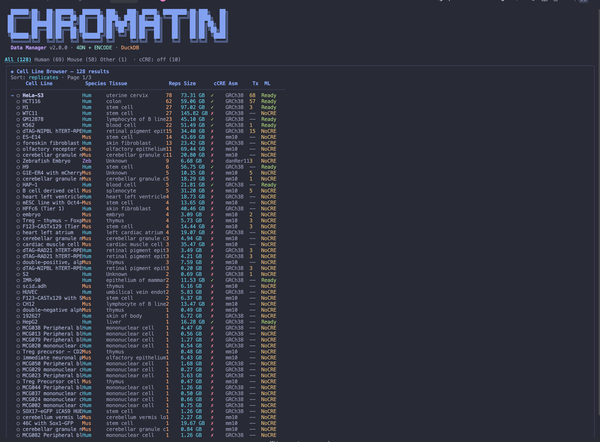

# Chromatin Data Manager v2.0

Interactive terminal UI for managing chromatin interaction data from **4DN** and **ENCODE** portals.

Built with **Ink (React)** + **DuckDB** + **Python** backend. Tokyo Night theme.

## Screenshot



## Features

- **Interactive TUI** — Dashboard, cell line browser, download manager, statistics, SQL query runner
- **DuckDB Database** — Fast OLAP queries on 1TB+ of chromatin data
- **Parallel Downloads** — Multi-threaded download with resume support
- **Flexible Filtering** — `--paired`, `--tissues`, `--min-replicates`, `--max-size`, etc.
- **Real-time API Fetching** — Live data from 4DN and ENCODE
- **Parquet Export** — Columnar format for downstream analysis
- **JSON IPC** — Node↔Python bridge for seamless integration
- **Server-Ready** — Deploy on any server, download specific datasets remotely

## Quick Start

```bash
# Install dependencies
npm install
pip install -r requirements.txt

# Copy and configure secrets
cp .env.example .env
# Edit .env with your 4DN credentials

# Build TypeScript
npm run build

# Fetch data from APIs (first run)
node dist/cli.js --fetch

# Launch interactive TUI
node dist/cli.js

# Or use direct commands
node dist/cli.js --list                          # List all mcool files
node dist/cli.js --list --cell-line GM12878      # Filter by cell line
node dist/cli.js --list --paired                 # Only paired datasets
node dist/cli.js --duplicates                    # Check replicates
node dist/cli.js --report --one-per-cell         # Generate CSV report
```

## CLI Flags

### Actions
| Flag | Description |
|------|-------------|
| `--fetch` | Fetch data from 4DN/ENCODE APIs |
| `--list` | List available datasets (JSON) |
| `--report` | Generate CSV report |
| `--test` | Test download a small cCRE file |
| `--duplicates` | Check for duplicate experiments |
| `--download` | Download datasets for a cell line |
| `--download-all` | Download all matching datasets |

### Filters
| Flag | Description |
|------|-------------|
| `--paired` | Only paired datasets (Hi-C + cCRE) |
| `--non-paired` | Only non-paired datasets |
| `--cell-line <name>` | Filter by cell line name |
| `--tissues <list>` | Filter by tissue types (comma-separated) |
| `--one-per-cell` | One sample per cell line (largest) |
| `--min-replicates <n>` | Minimum replicate count |
| `--max-replicates <n>` | Maximum replicate count |
| `--min-size <gb>` | Minimum file size in GB |
| `--max-size <gb>` | Maximum file size in GB |
| `--limit <n>` | Limit number of results |

### Examples

```bash
# Download 5 paired cell lines
node dist/cli.js --download-all --paired --limit 5

# Download specific tissues
node dist/cli.js --download-all --tissues "Leukemia,B-lymphocyte"

# List cell lines with 3+ replicates under 30GB
node dist/cli.js --list --min-replicates 3 --max-size 30

# Generate minimal report
node dist/cli.js --report --one-per-cell --output report.csv
```

## Architecture

```
chromatin-manager/
├── source/                    # TypeScript Ink CLI
│   ├── cli.tsx               # Entry point with all CLI flags
│   ├── app.tsx               # Main app with navigation
│   ├── components/           # React components
│   │   ├── Header.tsx        # ASCII logo header
│   │   ├── MainMenu.tsx      # Interactive menu
│   │   ├── Dashboard.tsx     # Stats overview
│   │   ├── CellLineBrowser.tsx # Interactive table
│   │   ├── DownloadManager.tsx # Download queue UI
│   │   ├── Statistics.tsx    # Charts & graphs
│   │   ├── QueryRunner.tsx   # SQL query interface
│   │   ├── FetchData.tsx     # API fetch progress
│   │   ├── BoxPanel.tsx      # Themed box component
│   │   ├── Spinner.tsx       # Loading spinner
│   │   └── StatusBar.tsx     # Status bar
│   ├── hooks/
│   │   └── use-python.ts     # React hook for Python calls
│   ├── lib/
│   │   ├── python-bridge.ts  # Node↔Python IPC
│   │   └── format.ts         # Formatting utilities
│   └── theme/
│       └── colors.ts         # Tokyo Night color theme
├── src/python/               # Python backend
│   ├── db.py                 # DuckDB schema & operations
│   ├── data_manager.py       # Core data fetching & downloads
│   └── ipc.py                # JSON IPC bridge
├── data/                     # Generated data (gitignored)
│   ├── processed/            # DuckDB database
│   ├── raw/                  # Parquet exports
│   ├── cache/                # API response cache
│   ├── downloads/            # Downloaded files
│   │   ├── mcool/
│   │   └── ccre/
│   └── reports/              # Generated reports
├── .env                      # Secrets (gitignored)
├── .env.example              # Template
├── package.json
├── tsconfig.json
└── requirements.txt
```

## Tech Stack

| Layer | Technology |
|-------|-----------|
| **Database** | DuckDB (embedded OLAP) |
| **Data Format** | Parquet (columnar) |
| **CLI Framework** | Ink 4 (React for terminal) |
| **Language** | TypeScript + Python |
| **Theme** | Tokyo Night (darkest) |
| **APIs** | 4DN Portal + ENCODE |

## DuckDB Tables

- `cell_lines` — Master cell line table
- `chromatin_experiments` — Hi-C/mcool file records
- `regulatory_annotations` — cCRE BED file records
- `download_queue` — Download management
- `paired_datasets` (view) — Auto-computed paired data
- `stats_summary` (view) — Aggregate statistics

## Future: Deep Learning Pipeline

This codebase is designed to feed into a deep learning processing pipeline:
1. Download paired chromatin + regulatory data
2. Process mcool files with cooler/cooltools
3. Extract contact matrices at multiple resolutions
4. Train models on chromatin interaction patterns
